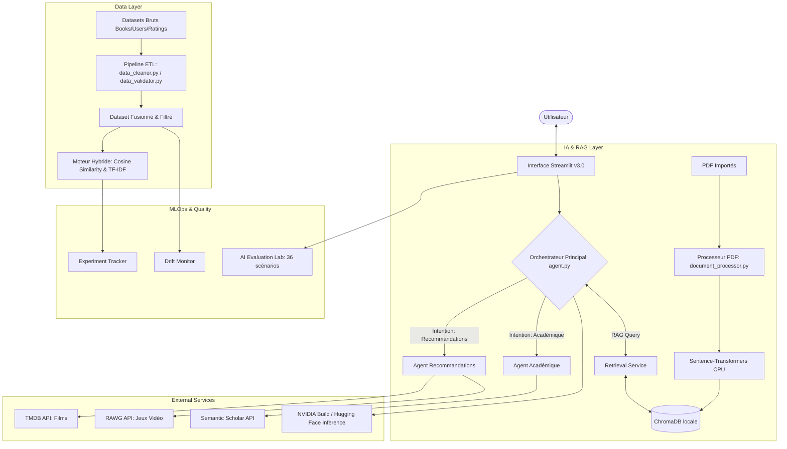

# 📘 BookLens — Système de Recommandation Hybride de Livres

<p align="center">
  <strong>Data Engineering · Machine Learning · Agent IA · Recherche Académique</strong>
</p>

---

## 🎯 Qu'est-ce que BookLens ?

**BookLens** est une application interactive de recommandation de livres combinant data engineering, machine learning hybride et agent IA conversationnel. C'est un projet portfolio complet démontrant la maîtrise de ces compétences :

| Domaine | Ce que vous trouverez |
|---|---|
| 🔧 **Data Engineering** | NVIDIA Data Designer (génération synthétique), pipeline ETL complet (validation, nettoyage) 100% CPU-compatible |
| 🤖 **Machine Learning** | Recommandation hybride (Filtrage Collaboratif + Contenu TF-IDF) avec feedback utilisateur |
| 💬 **Agent IA** | Assistant NVIDIA (Llama 3.3) avec fallback intelligent (détection d'intention + mémoire) |
| 🎓 **Recherche Académique** | Corpus spécialisé SF écoféministe/postcoloniale |
| 📊 **Data Visualization** | Dashboard Plotly interactif en thème sombre |

---

## 🚀 Démarrage Rapide

### Prérequis

- Python 3.9+
- pip

### 💻 Prérequis Système

Ce projet est conçu pour être **léger et fonctionner entièrement sur CPU en local**. Il ne requiert **aucun GPU dédié** ni d'installation CUDA pour fonctionner. 
Les seules dépendances requises sont standards (Pandas, Scikit-learn, Streamlit).

> [!NOTE]
> *Optimisation GPU Future* : Si le projet venait à être migré sur une machine avec GPU dédié NVIDIA, une version ultérieure pourra explorer l'accélération matérielle (comme NVIDIA cuDF) de manière transparente.

## 🛠️ Installation

```bash
# Se placer dans le répertoire du projet
cd app_build

### Déploiement Local
```bash
python -m venv venv
source venv/bin/activate  # ou venv\Scripts\activate sur Windows
pip install -r requirements.txt
python generate_sample_data.py
streamlit run app.py
```

## 🧠 Skills NVIDIA Intégrés
Ce projet explore l'utilisation des agents de développement augmentés par les catalogues NVIDIA.
- **`data-designer`** : Permet de concevoir des pipelines de données synthétiques (utilisateurs, notes). Installé via `npx skills add nvidia/skills --skill data-designer`.

*(Note: La génération via data-designer nécessite l'installation du CLI NVIDIA correspondant dans l'environnement Python).*

## 🏗️ Architecture du Projet



### Configuration (optionnel)

Pour activer l'agent IA avec le LLM NVIDIA (Llama 3.3), créez un fichier `.env` :

```bash
cp .env.example .env
# Éditez .env et ajoutez votre clé NVIDIA_API_KEY
# (Clé API gratuite sur https://build.nvidia.com/ sans carte bancaire, limite ~40 req/min)
```

> 💡 L'application fonctionne **parfaitement sans clé API** grâce au système de fallback intelligent.

### Lancement

```bash
streamlit run app.py
```

L'application s'ouvre à **http://localhost:8501**.

---

## 📁 Structure du Projet

```
app_build/
├── app.py                          # 🏠 Point d'entrée (page d'accueil)
├── requirements.txt                # 📦 Dépendances
├── .env.example                    # 🔑 Template de configuration
├── generate_sample_data.py         # 🏭 Générateur de données
│
├── data/
│   ├── raw/                        # 📂 CSV bruts
│   │   ├── Books.csv
│   │   ├── Users.csv
│   │   ├── Ratings.csv
│   │   └── academic_scifi_books.csv  # 🎓 Corpus académique
│   ├── processed/                  # 📂 Données nettoyées
│   └── cache/                      # 📂 Cache API Open Library
│
├── src/                            # 🧩 Modules
│   ├── media/                      # 🎬 Architecture modulaire multimédia
│   │   ├── base.py                 # Interface commune
│   │   ├── books/                  # Gestionnaire de livres
│   │   ├── movies/                 # Gestionnaire de films (TMDB)
│   │   └── games/                  # Gestionnaire de jeux vidéo (RAWG)
│   ├── data_loader.py              # 📥 Chargement
│   ├── data_validator.py           # ✅ Validation de schéma & anomalies
│   ├── data_cleaner.py             # 🧹 Nettoyage & fusion
│   ├── data_enricher.py            # 🌐 Enrichissement API
│   ├── recommender.py              # 🤖 Modèle hybride
│   ├── agent.py                    # 💬 Agent IA (NVIDIA Llama + Fallback)
│   ├── ui.py                       # 🎨 Design System CSS
│   ├── visualizations.py           # 📊 Graphiques Plotly
│   └── monitoring.py               # 📈 Télémétrie, Logs & Metrics
│
├── pages/                          # 📄 Pages Streamlit
│   ├── 1_🔍_Livres.py
│   ├── 2_🎬_Films.py
│   ├── 3_🎮_Jeux_Video.py
│   ├── 4_⭐_Recommandations.py
│   ├── 5_📊_Dashboard.py
│   ├── 6_🤖_Agent_IA.py
│   ├── 7_🌐_Cross_Media.py
│   ├── 8_🎓_Recherche_Academique.py
│   ├── 9_👤_Mon_Profil.py
│   ├── 10_📚_Bibliothèque_de_recherche.py
│   ├── 11_🔀_Comparer.py
│   ├── 12_🧱_Architecture.py       # Visualisation des APIs et statuts
│   ├── 13_⚙️_Dashboard_Technique.py # Graphiques de latence et logs en direct
│   ├── 14_ℹ️_A_Propos.py           # Architecture & Conception
│   ├── 15_🕸️_Graphe.py             # Vue graphe relationnelle
│   ├── 16_🧪_AI_Evaluation_Lab.py   # AI Evaluation Lab
│   ├── 17_🔄_MLOps_et_Modèles.py    # MLOps experiments & monitoring
│   └── 18_🔒_Confidentialité_&_Sécurité.py # AI security policy & status
│
├── scripts/
│   └── refresh_data.py             # 🔄 Script de rafraîchissement
│
└── models/                         # 💾 Modèles sauvegardés
```

---

## 📚 Fonctionnalités

### 🔍 Recherche de Livres
Explorez la base de données complète avec filtres (auteur, éditeur, note minimale).

### ⭐ Recommandations Hybrides
- **Filtrage collaboratif** (cosinus sur la matrice user-item) + **contenu** (TF-IDF)
- **Feedback utilisateur** : 👍/👎 ajustent dynamiquement les scores
- **Filtrage par thème** (écoféminisme, dystopie, utopie...)

### 📊 Dashboard Analytique
Graphiques Plotly interactifs : distribution des notes, top livres, auteurs, tendances.

### 🤖 Agent IA
- **Mode LLM** : Assistant NVIDIA Llama 3.3 contextualisé avec les données de l'app
- **Mode Fallback** : Détection d'intention (7 catégories) + mémoire des livres mentionnés

### 🎓 Recherche Académique
Corpus de 23 œuvres majeures en science-fiction féministe/écoféministe (Le Guin, Butler, Haraway...).

### 👤 Mon Profil de Lecture
Sélectionnez vos favoris pour des recommandations personnalisées agrégées.

### 🔀 Comparer Deux Livres
Comparaison côte à côte avec scores (collaboratif, contenu, hybride) et analyse des points communs/différences.

### ℹ️ À Propos
Documentation technique embarquée, architecture et métriques du modèle.

---

## 🧠 Comment fonctionne le ML Hybride ?

```
Score Final = 70% × Score_Collaboratif + 30% × Score_Contenu + Feedback

Score Collaboratif :
  Matrice User × Book → Cosinus entre colonnes de livres

Score Contenu (TF-IDF) :
  "Auteur Thème Description" → Vecteur TF-IDF → Cosinus entre vecteurs

Feedback :
  👍 → +10% sur le score du livre
  👎 → -15% sur le score du livre
```

> 📖 Consultez `production_artifacts/ml_report.md` pour un rapport détaillé.

---

## 🔧 Data Engineering

### Validation
Le module `data_validator.py` vérifie :
- La présence et les types des colonnes attendues
- Les valeurs manquantes critiques
- Les anomalies dans les ratings (doublons, hors plage, utilisateurs suspects)

### Enrichissement
Le module `data_enricher.py` récupère des métadonnées depuis **Open Library API** (couvertures, sujets) avec un cache JSON local.

### Script de Rafraîchissement
```bash
python scripts/refresh_data.py          # Pipeline complet
python scripts/refresh_data.py --enrich  # + enrichissement API
```

---

## 🚀 Déploiement sur Streamlit Community Cloud

1. Poussez le code sur GitHub
2. Connectez-vous à [share.streamlit.io](https://share.streamlit.io)
3. Pointez vers `app_build/app.py`
4. Ajoutez `NVIDIA_API_KEY` dans **Settings > Secrets**

L'application fonctionne sans clé API (fallback automatique).

---

## 🔒 Sécurité et Robustesse (Phase 1)

Ce projet implémente plusieurs bonnes pratiques de sécurité côté applicatif :
- **Gestion des Secrets** : La clé API NVIDIA n'est jamais hardcodée. Elle est chargée via `st.secrets` sur le cloud, ou via les variables d'environnement (`.env`) en local, avec un `.streamlit/secrets.toml.example` fourni.
- **Rate Limiting** : La page Agent IA inclut une limite de fréquence en mémoire (ex: max 10 messages/minute) pour éviter l'épuisement du quota de l'API.
- **Validation des Entrées** : Les requêtes utilisateur au chat sont limitées en taille (max 1000 caractères) et subissent un échappement HTML de base.
- **Gestion Centralisée des Erreurs** : L'Agent gère proprement les exceptions (`AuthenticationError`, `RateLimitError`) sans exposer de stack technique à l'utilisateur.
- **Transparence** : L'interface affiche clairement quand les données sont envoyées à NVIDIA Build et précise la politique de confidentialité locale.

---

## 🌍 Support Multilingue (Phase 1.5)

L'application intègre un système d'internationalisation natif (`src/i18n.py`) basé sur des dictionnaires JSON.
Les langues actuellement supportées sont :
- 🇫🇷 **Français** (défaut)
- 🇬🇧 **Anglais**
- 🇨🇳 **Chinois (Mandarin Simplifié)**

**Comment ça marche ?**
1. L'interface principale (`app.py`) et l'Agent IA lisent les textes dynamiquement depuis `locales/*.json`.
2. Le sélecteur de langue dans la barre latérale met à jour l'état de la session (`st.session_state`).
3. Le **Prompt Système du LLM NVIDIA** est dynamiquement ajusté pour forcer l'Agent à répondre dans la langue active (ex: `"你必须用简体中文回答"`), tout en gardant les titres des livres dans leur langue d'origine pour éviter les désynchronisations avec la base de données.

*Note : Actuellement, seules les interfaces et les réponses de l'IA sont traduites. Les métadonnées brutes des livres (titres originaux, résumés de la base de données) restent en anglais.*

---

## 📚 Enrichissement et API Académique (Phase 2)

Afin d'apporter de véritables données à l'application, nous avons connecté deux APIs majeures avec un système de cache local intelligent (`data/cache/`) :

1. **Open Library API** : 
   - Lors de la génération des données (`generate_sample_data.py`), de vrais ISBNs célèbres sont injectés.
   - Le module `data_enricher.py` va chercher les vrais titres, auteurs, années, et résumés pour écraser les fausses données générées.
2. **Semantic Scholar API** :
   - Plus de 200 millions d'articles scientifiques sont accessibles gratuitement.
   - Intégrée dans la nouvelle page **🎓 Recherche Académique** (onglet Semantic Scholar).
   - Intégrée à l'**Agent IA** : Posez des questions comme *"Trouve des articles sur l'écoféminisme"*, et l'agent interrogera directement Semantic Scholar pour vous faire une synthèse !

---

## 🤖 Architecture Multi-Fournisseurs IA (Phase 3)

BookLens dispose maintenant d'une couche d'abstraction (`src/llm_provider.py`) pour interroger différents fournisseurs de modèles d'IA sans bloquer le code.

1. **NVIDIA Llama Nemotron** : Le fournisseur historique par défaut (Llama-3.3-70B optimisé).
2. **Hugging Face Inference Providers** :
   - Support natif ajouté via l'endpoint compatible OpenAI de Hugging Face (`router.huggingface.co/v1`).
   - Modèle texte par défaut : `meta-llama/Llama-3.2-3B-Instruct`.
   - **Obtenir une clé** : Créez un compte sur [Hugging Face](https://huggingface.co/), allez dans *Settings > Access Tokens*, et créez un Token "Read". Le tier gratuit permet d'expérimenter confortablement. Ajoutez-le dans `.streamlit/secrets.toml` sous `HF_API_KEY`.

### 🚀 Exploration pour la Phase 5 (Modèles Vidéo & Recommandations temps réel)
L'intégration de Hugging Face prépare le terrain pour l'utilisation de futurs modèles gratuits pour générer des extraits animés ou des recommandations streaming.

---

## 🎨 Multimodalité (Phase 4)

BookLens exploite les modèles gratuits de **Hugging Face Inference API** pour ajouter deux super-pouvoirs à l'agent :
1. **Génération d'images (FLUX.1-dev)** : Demandez à l'agent (ex: *"Dessine une couverture"*) pour qu'il génère une image à la volée directement dans le chat.
2. **Synthèse Vocale (MMS-TTS)** : Cliquez sur le bouton "🔊 Écouter" sous les réponses de l'agent pour lancer une synthèse vocale (fr/en/zh selon la langue sélectionnée).

*Note : Ces modèles sont interrogés directement via des appels REST `requests` depuis `src/llm_provider.py`, sans alourdir les dépendances.*

---

## 🎬 Extension Multimédia (Films & Jeux Vidéo — Phase 5)

BookLens s'ouvre à de nouveaux horizons en intégrant des sections pour les **Films** (API TMDB) et les **Jeux Vidéo** (API RAWG) :
1. **Architecture Modulaire Commune** (`src/media/`) : Une interface unifiée (`BaseMediaManager`) partagée entre Livres, Films et Jeux pour structurer la recherche, la gestion des caches JSON locaux et les recommandations.
2. **Recommandations Hybrides pour Films/Jeux** : Combine le signal collaboratif des APIs respectives (TMDB recommendations, RAWG suggested) et le contenu textuel calculé en local (similarité cosinus TF-IDF sur les synopsis, genres et développeurs).
3. **Recommandations Croisées (Cross-Media)** : Permet de choisir un livre et d'obtenir automatiquement des suggestions de films et jeux thématiquement compatibles.
4. **Agent IA Contextuel** : L'agent IA détecte les intentions cross-media et injecte dynamiquement des données de films et jeux vidéo issus de l'API dans le prompt système pour répondre intelligemment.

---

## 🧱 Vitrine Technique et Monitoring (Phase 6)

BookLens intègre désormais des outils de démonstration avancés pour valoriser son architecture en production :
1. **Page Architecture & Statuts** (`pages/11_🧱_Architecture.py`) : Une grille visuelle interactive recensant les 6 briques connectées au projet (NVIDIA, Hugging Face, Open Library, Semantic Scholar, TMDB, RAWG) avec leur état de connexion en temps réel (Connecté ou Fallback).
2. **Dashboard Technique & Admin** (`pages/12_📊_Dashboard_Technique.py`) : Tableau de bord dynamique affichant le volume total d'appels par API, les taux d'erreur, les latences moyennes via des graphiques Plotly et la console de logs.
3. **Logs JSON Structurés** (`src/monitoring.py`) : Système de traçabilité local enregistrant chaque requête sortante (timestamp, nom de l'API, succès, latence, erreur éventuelle) dans `logs/app.log` sous format JSON avec rotation de fichier (RotatingFileHandler).
4. **Routage Multi-Agents** : Découpage de l'agent principal en deux sous-agents autonomes (`RecommendationAgent` et `AcademicAgent`) avec des instructions systèmes et personnalités distinctes, orchestrés dynamiquement selon l'intention de l'utilisateur.

---

## 📚 RAG Académique Local (Phase 7)

BookLens intègre un module de RAG (Retrieval-Augmented Generation) 100% local, sécurisé et optimisé pour le CPU, permettant d'ingérer et d'interroger des PDF scientifiques :
1. **Bibliothèque de Recherche** (`pages/10_📚_Bibliothèque_de_recherche.py`) : Interface de dépôt (drag & drop), validation des fichiers (PDF uniquement, max 20 Mo), découpage par page en chunks de 800 caractères (avec 150 caractères de chevauchement), registre de métadonnées SQLite/JSON, et recherche sémantique avec filtres.
2. **Embeddings & Vector Store** (`src/rag/`) : Utilise `sentence-transformers` avec le modèle multilingue léger `paraphrase-multilingual-MiniLM-L12-v2` exécuté sur CPU, couplé à une base vectorielle persistante `ChromaDB` stockée localement dans `data/chroma_db/`.
3. **Sécurité & Filtrage Actif** : Détection et neutralisation par expressions régulières des tentatives simples d'injection de prompt (heuristiques type "ignore previous instructions") contenues dans les documents PDF importés.
4. **Intégration Agent IA** : Zone de chat dotée d'un commutateur ("Chat général" vs "Recherche dans mes documents"). En mode RAG, les extraits du document sont injectés comme contexte strict au LLM avec obligation de citer ses sources exactes (document, page). Les passages correspondants s'affichent sous forme d'accordéon rétractable sous les réponses.

---

## 🧪 AI Evaluation Lab (Phase 8)

BookLens propose désormais une suite d'évaluation IA locale, modulaire et reproductible, permettant d'auditer objectivement les performances des agents :
1. **Dataset de test versionné** (`data/evaluation/eval_cases.json`) : 36 cas de test couvrant la recommandation simple, cross-media, recherche académique, RAG, routage, robustesse aux injections de prompt et exfiltration de clés. Équilibré à part égale (12 cas chacun) en Français, Anglais et Chinois.
2. **Métriques Déterministes** (`src/evaluation/eval_metrics.py`) : Scoring de 0 à 100 avec déductions objectives (erreur de routage, langue inadéquate, absence de sources dans le RAG, citations inventées, fuite de clés secrètes).
3. **Moteur d'Exécution & PDF Temporaire** (`src/evaluation/eval_runner.py`) : Trois modes : *Mock (Simulé)*, *Single Provider (Appel réel)* et *Comparison (NVIDIA vs Hugging Face)*. Génération automatique d'un PDF minimal de test pour les scénarios RAG. Limite de sécurité de 10 cas simultanés par défaut pour économiser les quotas.
4. **Dashboard d'Évaluation** (`pages/16_🧪_AI_Evaluation_Lab.py`) : Tableau de bord affichant les taux de succès, score moyen, latence moyenne, taux de fallback, distribution des latences, et un explorateur détaillé pour chaque cas de test avec téléchargement des rapports JSON/CSV/Markdown.

---

## 🔧 Technologies

| Technologie | Usage |
|---|---|
| [Streamlit](https://streamlit.io/) | Framework web interactif |
| [pandas](https://pandas.pydata.org/) | Manipulation de données |
| [scikit-learn](https://scikit-learn.org/) | ML (TF-IDF, Cosinus) |
| [scipy](https://scipy.org/) | Matrices creuses |
| [Plotly](https://plotly.com/) | Graphiques interactifs |
| [ChromaDB](https://www.trychroma.com/) | Base de données vectorielle locale |
| [Sentence-Transformers](https://sbert.net/) | Modèle d'embeddings multilingue local |
| [PyMuPDF / pypdf](https://github.com/pymupdf/PyMuPDF) | Extraction de texte PDF robuste |
| [NVIDIA Build](https://build.nvidia.com/) | Agent IA (Llama 3.3 70B) |
| [Open Library API](https://openlibrary.org/) | Enrichissement de données |

---

<p align="center">
  <em>BookLens v8.0 — Projet Portfolio Data Engineering, ML, IA, RAG & AI Eval Lab</em>
</p>
