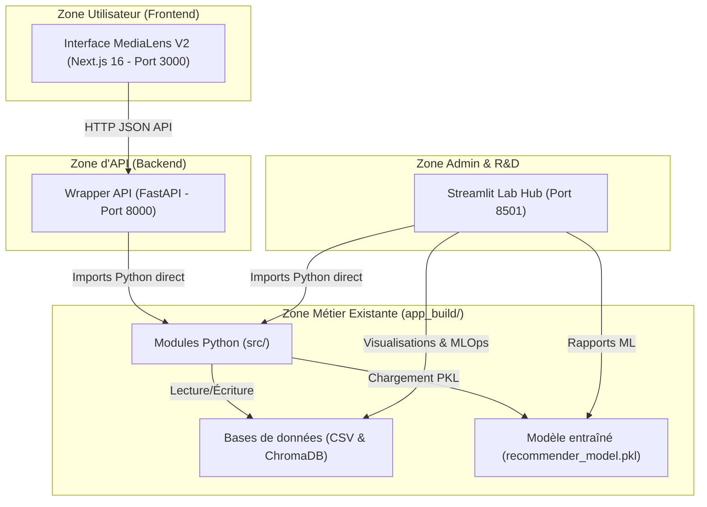

# Architecture de MediaLens V2

Ce document décrit l'organisation technique de MediaLens V2, la communication entre l'interface utilisateur, le wrapper FastAPI et les services Python existants, ainsi que la coexistence avec le portail de laboratoire Streamlit.

---

## 1. Flux de communication global

Le diagramme ci-dessous illustre le flux de requêtes entre le nouveau frontend Next.js, le wrapper FastAPI, la base de code Python existante et le portail d'administration Streamlit.

---

## 2. Rôles et responsabilités des composants

### A. Frontend Next.js 16 (`frontend/`)
- **Rôle** : Interface grand public de niveau portfolio.
- **Technologies** : TypeScript strict, Tailwind CSS v4, Motion (animations fluides).
- **Fonctionnalités** : Recherche universelle, navigation par rails éditoriaux, fiches détaillées avec explications sémantiques, assistant conversationnel IA multi-modes, bibliothèque personnelle de favoris (localStorage) et documents.
- **Sécurité** : Ne stocke aucun secret ou clé API en dur. Tout appel sensible transite par FastAPI.
- **Résilience** : Bascule en "Mode Démo" avec des mocks locaux si le serveur FastAPI est indisponible.

### B. Wrapper API FastAPI (`backend_api/`)
- **Rôle** : Passerelle d'API unifiée pour le frontend.
- **Technologies** : FastAPI, Pydantic (validation stricte des schémas), Uvicorn.
- **Fonctionnalités** :
  - `sys.path` modifié à la volée pour importer `app_build/src/` sans duplication de code.
  - Gestion des en-têtes CORS pour sécuriser les requêtes provenant du domaine frontend.
  - Exposition propre des erreurs HTTP et interdiction des tracebacks bruts.

### C. Application Streamlit (`app_build/`)
- **Rôle** : Conservée intacte en tant que **portail d'administration et de recherche**.
- **Fonctionnalités** :
  - Évaluation technique des prompts et agents.
  - Dashboard technique MLOps, graphes relationnels complexes.
  - Outils d'administration, chargement et nettoyage de données brutes.

---

## 3. Stratégie de migration progressive

Pour assurer une transition sans risque, la migration suit les principes suivants :

1. **Isolation stricte** : Le code Next.js et FastAPI vit en dehors de `app_build/`.
2. **Partage de l'état** : FastAPI et Streamlit pointent vers les mêmes fichiers physiques sur le disque (`app_build/data/chroma_db`, `app_build/models/recommender_model.pkl`).
3. **Consommation de services** : Toutes les futures fonctionnalités d'IA et de recommandation seront écrites sous forme de classes Python réutilisables dans `src/` puis importées par FastAPI et Streamlit.
